# Recordz — Marketplace

Cette application Web Java Full Stack représente une place de marché Suisse permettant aux vendeurs et aux acheteurs
d'acheter et de vendre des articles de luxe sans frais de transaction. Aucun coût n'est facturé lors de la mise en vente
ou de l'achat d'un article.

Le financement se fera par la mise en évidence des articles sur les pages principales.

Stack : **Java 21 · Vaadin 25.0.6 · Spring Boot 4.0.1 · Spring Security · OAuth2 Google · jOOQ 3.20.11 · MySQL / MariaDB · Flyway · Docker · Stripe**

Base de données : schéma **`new_db_recordzv3`** (marketplace suisse — vêtements, électronique, automobile, immobilier, vins, jeux vidéo, instruments de musique, enchères…). Migration Flyway de référence : `recordz-core/src/main/resources/db/migration/new_db_recordzv3.sql`.

https://github.com/user-attachments/assets/3d7bcc19-9083-4080-a51e-5fcf0e230eb3

https://github.com/user-attachments/assets/502e66e0-90f8-4fb0-b37f-e65362d9bcac

https://github.com/user-attachments/assets/e759f9c3-66ef-4efb-99f5-e367ad3b2620

---

## Architecture du schéma (résumé)

Le schéma `new_db_recordzv3` est fortement dénormalisé sur la table `article` : une seule table plate porte tous les attributs possibles (vêtements, automobile, immobilier, vins, jeux vidéo, informatique, etc.), remplis ou non selon la catégorie. Les libellés multilingues passent systématiquement par des tables `xxx_libelle_langue` qui font le lien vers la table `libelle` commune.

| Groupe | Tables clés | Rôle |
|---|---|---|
| Catalogue | `article`, `met_en_vente`, `article_ip`, `article_visite` | Annonce plate multi-catégories + mise en vente par vendeur + tracking visites/IP |
| Cycle de vente | `enchere`, `a_paye`, `a_livre`, `transaction`, `commande`, `commande_article` | Enchères → paiement (`a_paye`) → livraison (`a_livre`) ; `transaction`/`commande` legacy |
| Utilisateurs | `personne`, `app_user`, `boutique`, `boutique_a_categorie`, `visiteur`, `sessions` | Comptes (email unique), boutiques vendeur, sessions PHP legacy |
| Souhaits & interactions | `wish`, `wish_list`, `commentaire`, `demande_visite`, `recherche` | Liste de souhaits, Q&A sur annonce, demandes de visite, recherches sauvegardées |
| Évaluations | `evaluation_achat`, `evaluation_article`, `evaluation_vente` | Notes/commentaires acheteur ↔ vendeur ↔ article |
| Logistique | `depot`, `condition_livraison`, `condition_livraison_libelle_langue`, `condition_payement_libelle_langue` | Dépôts physiques, modes de livraison/paiement et leurs frais |
| Catégorisation | `categorie_libelle_langue`, `subcategorie_libelle_langue`, `main_categorie_libelle_langue`, `genre` | Arborescence catégorie → sous-catégorie, tout en `_libelle_langue` |
| Référentiels génériques | `libelle`, `langue`, `canton_fr`, `pays`, `pays_present`, `departement`, `etat`, `taille_libelle_langue`, `pointure`, `states` | Traductions FR/DE, géographie CH/FR, tailles/pointures |
| Automobile | `boite_de_vitesse(_libelle_langue)`, `type_essence(_libelle_langue)` | Boîte de vitesse, type de motorisation |
| Vin | `cepage`, `pays_region_vin`, `type_de_vin(_libelle_langue)` | Cépage, région/pays, type de vin |
| Jeux / écrans | `type_de_jeux(_libelle_langue)`, `type_ecran(_libelle_langue)` | Genre de jeu vidéo, type d'écran |
| Immobilier | `location_ou_achat_libelle_langue` | Location vs achat |
| Comptes/paiement | `type_de_compte(_libelle_langue)`, `mode_de_payement(_libelle_langue)`, `publication_option(_libelle_langue)` | Types de compte, options de mise en avant payante |
| Divers / temps | `mois(_libelle_langue)`, `temps(_libelle_langue)` | Référentiels calendaires legacy |

**Points d'attention connus du schéma** (visibles dans le dump et gérés explicitement côté code, cf. `ArticleRepository`) :
- Les colonnes `date`, `enchere_date_debut`, `enchere_date_fin` sont typées `varchar`, pas `datetime` — le repository les caste et neutralise les valeurs `'0000-00-00 00:00:00'` (`NULLIF(CAST(... AS CHAR), '0000-00-00 ...')`) pour éviter l'erreur MariaDB *"Zero date value prohibited"*.
- Plusieurs colonnes de la table `libelle` référencées en clé primaire composite ont des doublons de `ref_libelle` pour un même `ref_categorie` (ex. `categorie_libelle_langue`), à garder en tête lors de jointures strictes.
- `article.montant`/`prix_achat` mélangent `double` et `decimal` selon les tables (`a_livre.montant` est `varchar` !) — les conversions sont faites manuellement dans les mappers (`toArticle`, requêtes `findArticlesAPaye`...).

---

## Démarrage rapide

```bash
# 1. Variables d'environnement
cp .env.example .env
# Remplir GOOGLE_CLIENT_ID, GOOGLE_CLIENT_SECRET, DB_*

# 2. Démarrer MySQL
docker compose up mysql -d

# 3. Générer le code jOOQ (après que Flyway ait créé les tables) — profil "codegen"
mvn generate-sources -P codegen -pl recordz-core \
  -Djooq.codegen.url=jdbc:mysql://localhost:3306/new_db_recordzv3 \
  -Djooq.codegen.user=root \
  -Djooq.codegen.password=


(Ou alors importer le fichier .sql dans PhpMyAdmin sans passer par l'étape numéro 3)

# 4. Lancer l'application
export GOOGLE_CLIENT_ID=...
export GOOGLE_CLIENT_SECRET=...
mvn spring-boot:run -pl recordz-web
```

→ [http://localhost:8081](http://localhost:8081)

---

## Structure du projet

```
recordz-core/                                      # Logique métier — indépendant de Vaadin/Web
└── src/main/java/com/example/recordz/
    ├── config/
    │   └── JooqConfig.java                         # DSL settings + @EnableCaching
    │   └── EntrupyProperties.java                  # Propriétés de connexion a Entrupy
    │   └── RestClientConfig.java                   # CLient REST a Entrupy
    ├── entrupy/
    │   └── EntrupySessionPayload.java              # Variable pour la validation par Entrupy
    │   └── EntrupyStatus.java                      # Statut de la validation
    │   └── EntrupyWebhookEvent.java                # Webhook Entrupy
    │   └── EntrupyWebhookService.java              # Service Entrupy
    ├── model/domain/
    │   ├── Article.java                            # Annonce marketplace (table plate multi-catégories)
    │   ├── Personne.java                           # Utilisateur / membre
    │   ├── Enchere.java                             # Mise aux enchères
    │   ├── Commande.java / Transaction.java         # Commande & transaction financière (legacy)
    │   ├── Boutique.java                            # Boutique vendeur
    │   ├── Wish.java / WishList.java                # Liste de souhaits
    │   ├── Commentaire.java                         # Q&A sur une annonce
    │   ├── Evaluations.java                          # Notes achat/vente/article
    │   ├── FiltreArticle.java                        # Objet de filtres dynamiques (recherche/catalogue)
    │   ├── ArticleCategory.java / ArticleSubCategory.java  # IDs de catégories/sous-catégories
    │   ├── EvenementCalendrier.java                  # Événement du calendrier vendeur
    │   ├── Referentiel.java                          # Agrégat de tous les référentiels (cantons, tailles...)
    │   └── dto/ArticleFormData.java                  # DTO du formulaire de dépôt d'annonce
    ├── repository/                                   # jOOQ DSL brut (table()/field())
    │   ├── ArticleRepository.java                    # Articles : recherche, filtres, cycle vente/livraison
    │   ├── PersonneRepository.java                   # Utilisateurs
    │   ├── EnchereRepository.java                    # Enchères
    │   ├── CommandeRepository.java                   # Commandes (legacy)
    │   └── ReferentielRepository.java                # Tables de référence, @Cacheable
    └── service/
        ├── ArticleService.java                       # Logique métier articles (lecture/recherche)
        ├── ArticleDynamicDataService.java            # Résolution des champs dynamiques par catégorie
        ├── ArticleSubmitService.java                 # Validation + dépôt d'une nouvelle annonce
        ├── EnchereService.java                       # Logique enchères avec validation
        ├── PersonneService.java                      # Logique utilisateurs
        ├── CalendrierService.java                    # Événements du calendrier vendeur
        └── ReferenceService.java                     # Résolution des libellés/référentiels par langue

recordz-web/                                        # Point d'entrée Spring Boot + UI Vaadin
└── src/main/java/com/example/recordz/
    ├── RecordzApplication.java
    ├── EnchereScheduler.java                       # Job planifié : clôture des enchères expirées
    ├── config/
    │   └── WebMvcConfig.java                       # ComfgurationMvc
    │   └── CacheConfig.java                        # Création du cache pour Jackson  
    ├── security/
    │   ├── SecurityConfig.java                       # Vaadin + OAuth2 Google
    │   ├── CustomOAuth2UserService.java              # Sync OAuth → personne (upsert par email)
    │   └── AuthenticatedUser.java                    # Accès à l'utilisateur courant depuis les vues
    └── ui/
        ├── layouts/MainLayout.java                   # Shell + nav drawer
        ├── LoginView.java / NouvelUtilisateurView.java     # Connexion & inscription
        ├── MainView.java / CatalogueView.java / CategorieView.java  # Accueil, catalogue, navigation catégories
        ├── ResultatsRechercheView.java                # Résultats de recherche
        ├── EncheresView.java                          # Enchères actives
        ├── ArticleFormView.java / DynamicArticleForm.java   # Dépôt d'annonce (formulaire dynamique par catégorie)
        ├── DetailArticleView.java                     # Fiche détail d'une annonce
        ├── FairePublicite.java / TarifView.java       # Mise en avant payante d'une annonce (Stripe)
        ├── MonCompteView.java / MonCompteHelper.java / InformationsPersonnellesView.java   # Espace membre
        ├── ProfilView.java / ProfilVendeurView.java   # Profil public / profil vendeur
        ├── CalendrierView.java                        # Calendrier vendeur
        ├── AProposView.java / OtherViews.java / TestUi.java  # Pages annexes et vues de test
        └── StyleHelper.java                           # Utilitaires de style Vaadin partagés
```

---

## Architecture logicielle

### Modules Maven

Le projet est découpé en deux modules pour séparer la logique métier de la couche web :

- **`recordz-core`** — modèles de domaine, repositories (accès données) et services (logique métier). Indépendant de Vaadin/Spring Web, réutilisable si une autre interface (API REST, batch) devait un jour consommer la même logique.
- **`recordz-web`** — point d'entrée Spring Boot, configuration, sécurité et interface utilisateur Vaadin. Dépend de `recordz-core`.

### Couches applicatives

L'application suit une architecture en couches classique :

```
┌─────────────────────────────────────┐
│   UI (Vaadin Views)                  │  recordz-web/ui
│   MainView, CatalogueView, ...       │
└──────────────┬────────────────────────┘
               │
┌──────────────▼────────────────────────┐
│   Service (logique métier)           │  recordz-core/service
│   ArticleService, EnchereService...  │
│   @Transactional                     │
└──────────────┬────────────────────────┘
               │
┌──────────────▼────────────────────────┐
│   Repository (accès données)         │  recordz-core/repository
│   DSL jOOQ brut                      │
└──────────────┬────────────────────────┘
               │
┌──────────────▼────────────────────────┐
│   MySQL/MariaDB (new_db_recordzv3)   │  via HikariCP
└─────────────────────────────────────┘
```

Chaque couche ne dépend que de la couche immédiatement inférieure : les vues Vaadin n'appellent jamais un repository directement, elles passent systématiquement par un service.

### Sécurité et authentification

L'authentification repose entièrement sur **OAuth2 Google** (pas de mot de passe local) :

1. `SecurityConfig` délègue la connexion à `VaadinSecurityConfigurer` + `oauth2Login`.
2. À chaque connexion, `CustomOAuth2UserService` intercepte le flux OIDC et fait un **upsert** dans la table `personne` (email = identifiant unique). Le champ `mot_de_passe` legacy n'est pas utilisé.
3. `AuthenticatedUser` expose ensuite l'utilisateur courant aux vues Vaadin sans qu'elles aient à connaître les détails OAuth2.

### Accès aux données

- **jOOQ en DSL brut** (`table("article")`, `field("nom")`) dans tous les repositories actuels, tant que la génération de code typée n'a pas encore été branchée en continu. La génération typée existe déjà comme profil Maven désactivé par défaut (`phase: none`) et s'active avec `mvn generate-sources -P codegen -pl recordz-core` (schéma cible : `new_db_recordz`). Une fois activée, remplacer progressivement par les classes générées : `import static com.example.recordz.jooq.tables.Article.ARTICLE`.
- **HikariCP** comme pool de connexions (`maximum-pool-size: 10`, `minimum-idle: 2`), configuré dans `application.yml` et `JooqConfig`.
- **Flyway** pilote le schéma via `recordz-core/src/main/resources/db/migration/new_db_recordzv3.sql`, chargée en `baseline-on-migrate: true` / `baseline-version: 0` (le schéma existant sert de point de départ). Toute évolution du schéma doit passer par une nouvelle migration versionnée, jamais par une modification de ce fichier.
- **Concurrence** : les opérations sensibles à la concurrence (ex. upsert OAuth2 dans `PersonneRepository`) s'appuient sur les contraintes `UNIQUE` en base (`personne.email`, `personne.nom_utilisateur`) plutôt que sur des vérifications applicatives, pour rester correctes sous forte charge concurrente.
- **Paiement** : intégration Stripe (`stripe-java`) pour la mise en avant payante des annonces (`FairePublicite`, `TarifView`).

### Caching

`ReferentielRepository` utilise `@Cacheable` pour les données de référence peu volatiles (cantons, catégories, libellés, etc.) — chargées une fois en mémoire au lieu d'un aller-retour DB à chaque affichage.
---

## Document d'analyse et d'architecture

> **Document source intégré :** `avant_garde__technologie_last_2026.docx`  
> **Date indiquée dans le document source :** 22/04/2013  
>
> Cette section reprend le document d'analyse et d'architecture fourni, converti du format DOCX vers Markdown.
> Le contenu est conservé comme documentation complémentaire : certaines informations techniques du document
> source décrivent des versions ou une architecture antérieures et peuvent donc différer de l'état actuel du dépôt
> documenté plus haut.

## 1. Description
Ce projet réside dans le fait de réaliser un site de vente aux enchères,
ce site sera financé par la publicité ce qui rendra possible la gratuité
de la création des comptes vendeurs et boutiques effectuées par les
utilisateurs, une transaction sera validée par un sms.

Ce site comprendra également une liste de vœux, cette liste définit les
articles qu’un utilisateur désire mais n’est pas encore disponible dans
les boutiques un système d’alerte sera créé ce qui permettra à
l’utilisateur d’être informé à l’arrivée de l’article.

Ce site est unique en son genre car il propose des critères de
recherches différents selon les catégories d'articles. Ces attributs
seront affichés dynamiquement lors du chargement d’une catégorie.

Il sera également utile pour toutes les boutiques de petites et moyennes
tailles pour pouvoir gérer ses stocks, des outils permettent de faire
des analyses des ventes.

Une option de parrainage sera également possible en offrant la
possibilité à n'importe quel utilisateur de créer un widget avec un
éventail de produits provenant d'une ou plusieurs boutiques, le
commissionnement pourra alors être défini par le gérant de la boutique.

Il existera des options payantes comme la mise en avant sur la page
principale, ou dans la page principale de la catégorie comme top
article.

Ceci est utile pour les boutiques ayant un certain nombre d'articles de
même nature et ayant un stock.

Il faut également prévoir un script permettant l’importation en masse
d’articles provenant d’une autre source de données cette importation
peut se faire en présentant les données sous forme de fichier texte
formaté à l’aide de « ; »

Lors de la création d’un compte l’adresse ip est enregistré pour
vérification du fournisseur d’accès avec le pays dans lequel
l’utilisateur s’enregistre, lors de chaque login l’utilisateur peut
consulter les dernières adresses ou pays d’où provenait les connexions
afin d’établir si un compte a été usurpé.

Lorsque l’utilisateur qui se connecte au site à son compte celui-ci est
informé par sms à l’accès afin que l’utilisateur puisse constater de
l’accès à son compte.

## 2. Modélisation
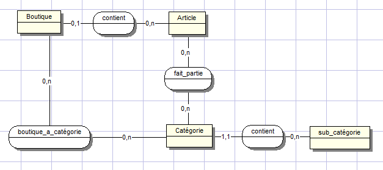

Une boutique contient zéro ou plusieurs articles, un article fait partie
de zéro ou une boutique. Cette cardinalité s’explique par le fait qu’un
article ne peut faire partie que d’une seule boutique particulière.

Un article fait partie d’une catégorie, une catégorie contient de zéro
ou plusieurs sous-catégories.

Une boutique possède de zéro à plusieurs catégories.

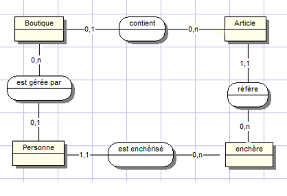

Dans cette modélisation on peut constater les relations et entités qui
permettent de définir le mécanisme relatif aux enchères. Une personne
dans ce contexte sera appelée enchérisseur, possède une relation à
l’entité enchère avec les cardinalités suivantes zéro à n. Une enchère
est quand à elle relative à un unique enchérisseur et donne donc les
cardinalités suivantes un à un.

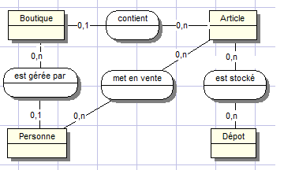

Ce modèle sert à modéliser la relation entre les articles et le dépôt,
ainsi que la relation avec un dépôt.

Un article est mis en vente par une personne, dans ce contexte la
personne est vue en tant que vendeur. Le vendeur met en vente un ou
plusieurs articles. Un article est mis en vente par un vendeur.

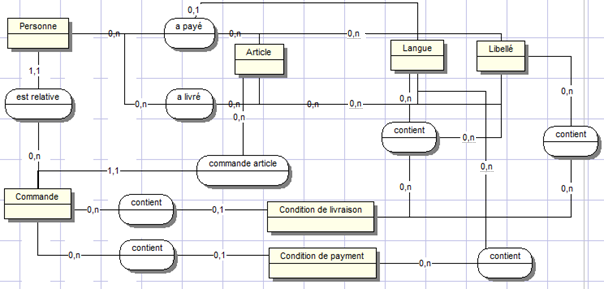

Ce modèle décrit les différentes relations entre les entités concernant
le processus d’achat et de paiement relatif aux articles mis aux
enchères. Une personne passe des commandes d’un ou plusieurs articles.
1,n.

Une commande contient une condition de livraison et une condition de
livraison peut être liée à plusieurs commandes.

Une commande contient une condition de paiement et une condition de
paiement peut être liée à plusieurs commandes.

Une personne à payer un ou plusieurs articles et un article a été payée
par une personne dans ce contexte l’acheteur.

Une condition de livraison contient une langue et une langue peut
contenir plusieurs conditions de livraisons, une condition de livraison
contient un libellé et un libellé peut être contenu par plusieurs
conditions de livraisons.

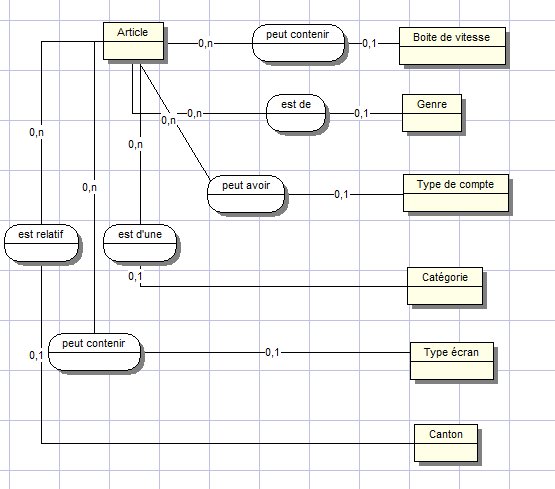

Un article peut contenir une boite de vitesse, une boite de vitesse peut
être référencée par plusieurs articles.

Un article peut contenir un genre, un genre peut être référencé par
plusieurs articles.

Un article peut contenir un type de compte, un type de compte peut être
contenu par plusieurs articles.

Un article peut faire partie d’un canton, un canton peut être référencé
par plusieurs articles.

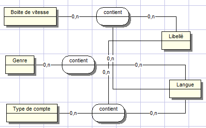

Une boite de vitesse contient zéro ou plusieurs libellés, le zéro
s’explique ici dans le fait qu’il n’impose pas d’ordre de création des
libellés avec les boîtes de vitesses, un libellé peut être contenu par
zéro ou plusieurs boîtes de vitesses. Un genre contient zéro ou
plusieurs langues, une langue peut être contenu par zéro ou plusieurs
langues.

Un type de compte contient zéro ou plusieurs libellés un libellé peut
être contenu par zéro ou plusieurs types de comptes. Un type de compte
contient zéro ou plusieurs à plusieurs libellés, un type de compte peut
être contenu par zéro ou plusieurs langues.

Lorsqu’une personne effectue des commandes d’articles, il est possible
de produire des factures liées aux articles commandées. Un article
possède une taxe de valeur ajoutée selon le type de produit dont il
s’agit, cette taxe est dépendante du pays où il est vendu et sera
répercutée sur la facture de la personne.

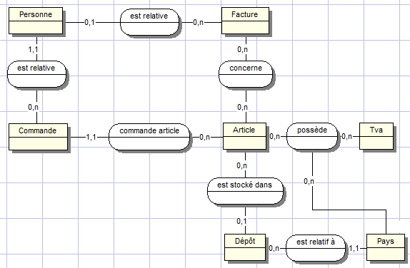

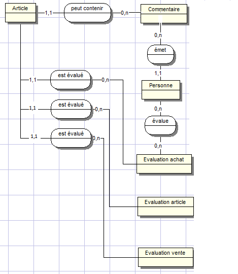

Un article peut contenir un ou plusieurs commentaires, un commentaire
est contenu par un article. Un commentaire est émis par une personne. Un
article possède une relation avec l’entité évaluation achat et article
les cardinalités sont les suivantes une évaluation vente est évaluée
pour un article.

Un article possède les cardinalités suivantes entre évaluation vente et
article sont les suivantes: une évaluation vente est évaluée pour un
article.

Cette modélisation définit les relations entre les utilisateurs et les
ventes et achats d’articles, un article peut contenir des commentaires,
un commentaire est émis par une personne.

Une relation entre personne et évaluation achat existe, elle désigne
l’action émise par une personne sur un achat et comporte un commentaire
ainsi qu’une note.

De la même manière une relation existe entre un article et l’entité
évaluation article ainsi qu’une relation évaluation vente.

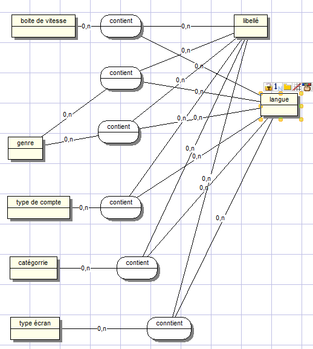

Dans cette modélisation nous pouvons constater des relations entre les
entités boite de vitesse, genre, type de compte, catégorie, type écran,
canton et les entités langue et libellé.

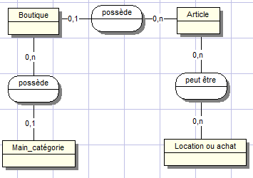

Dans cette modélisation nous pouvons constater les relations entre les
boutiques et l’entité main catégorie, les cardinalités sont les
suivantes entre boutique et main catégorie, une boutique fait partie
d’une ou une seule main catégorie, une main catégorie peut être possédé
par une ou plusieurs boutiques.

Un article dans le contexte d’un bien immobilier peut être en relation
avec l’entité location ou achat, les cardinalités sont les suivantes un
article peut être en location de zéro à plusieurs car la personne
possédant le bien peut changer le statut du bien immobilier pour le
mettre en location ou vente.

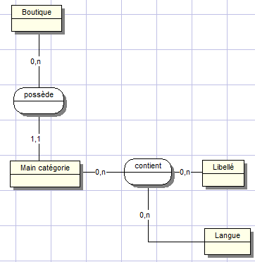

Une main catégorie peut contenir de zéro à plusieurs libellés, un
libellé peut être contenu par zéro ou plusieurs articles. Une main
catégorie peut contenir de zéro à plusieurs langues une langue peut être
contenu par zéro à plusieurs main catégorie.

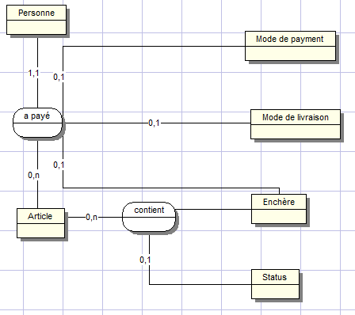

Dans cette modélisation nous pouvons constater les relations entre
personne et article, cette relation à payer devient une table car elle
contient les relations entre mode de livraison, mode de paiement,
enchère.

Un article apayé et contient un mode de livraison, un mode de livraison
peut être référé par un ou plusieurs articles. Un article a payé est
relatif à une enchère, une enchère est relative à un article.

Une personne a payé un ou plusieurs articles. Un article contient un ou
plusieurs statuts, un statut est une entité qui définit l’état d’un
article mis en vente par une personne. Un statut peut être de la liste
suivante :

- Temporaire

- En cours

- En stock

- Non disponible

- Vendu

- Attente de paiement

- A payer

- A livrer

- Livrer

- Invendu

- Envoyer

- Payé attente valide

- Livré attente valide

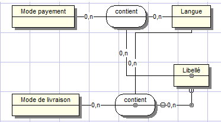

Un mode de paiement peut contenir zéro ou plusieurs langues, une langue
peut être contenue par zéro ou plusieurs modes de paiements. Un mode de
livraison peut contenir de zéro à plusieurs langues.

Une langue peut être contenue par zéro à plusieurs langues, une langue
peut être contenue par zéro à plusieurs langues.

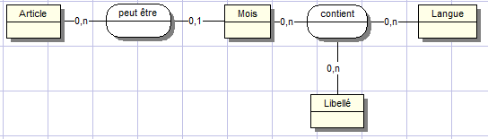

Un article peut être relatif à un mois, un mois peut être relatif à un
article. Un mois peut contenir de zéro à plusieurs langues, une langue
peut être contenu par un ou plusieurs mois. Un mois peut contenir de
zéro à plusieurs libellés un libellé peut être contenu par zéro à
plusieurs mois.

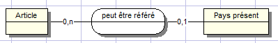

Un article de type vin peut être référé à un pays présent. Un pays
présent peut être référé à un article.

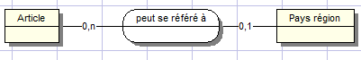

Un article de type vin peut être référé à une région d’un pays. Une
région d’un pays peut être référée à un article.

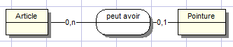

Un article de type chaussure peut avoir une pointure, une pointure peut
être référée par un ou plusieurs articles.

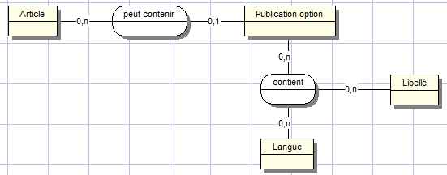

Un article peut contenir une option de publication, une option de
publication représente une action proposée à un vendeur tel que :

- Afficher sur la page d''accueil

- Afficher sur la page principale de la catégorie

- Pack de trois photos supplémentaires

Une publication option peut contenir de zéro à plusieurs libellés, un
libellé peut être contenu par zéro à plusieurs publications. Une
publication option peut être contenu par

Une personne peut effectuer zéro ou plusieurs recherches, ces recherches
sont relatives à une catégorie. Les recherches sont stockées afin
d'effectuer des statistiques sur les recherches effectuées par les
personnes.

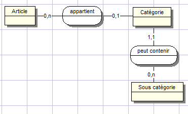

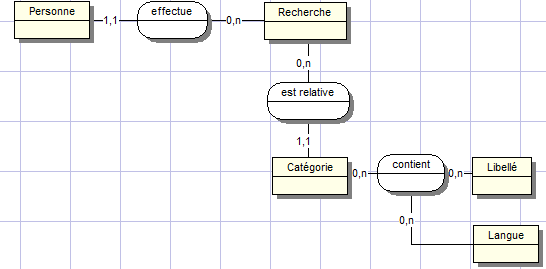

Une personne peut effectuer de zéro à plusieurs recherches, une
recherche peut être effectuée par une et une seule personne. Une
recherche est relative d’une à plusieurs catégories, une catégorie peut
être relative de zéro à une recherche.

Une catégorie peut contenir de zéro à plusieurs libellés, un libellé
peut être contenu par zéro à plusieurs catégories.

Une catégorie peut contenir de zéro à plusieurs langues, une langue peut
être contenue par zéro à plusieurs catégories.

Un article appartient à une catégorie, une catégorie peut contenir
plusieurs articles. Une catégorie peut contenir zéro ou plusieurs
sous-catégories. Une sous-catégorie appartient à une catégorie.

Voici la liste des différentes catégories d’articles présentés sur le
site internet :

- Habits femmes

- Habits hommes

- Habits enfants

- Mobilier

- Automobile

- Motos

- Matériels high tech

- Montres et bijoux

- Vins

- Vinyls / Cd / mp3

- Tv / vidéo / Informatique

- Sport

- Dvd

- Livres

- Consoles de jeux

- Diététique

- Parfums

- Accessoires de cuisines

- Instruments de musique

- Cosmétiques

- Matériel dj

- Collections

- Jouets

- Accessoire et outils

- Outillage à main

- Outillage électrique

- Peinture déco

- Jardin

- Lingerie

- Calendrier

- Vêtements bébé

- Electroménager

- Immobilier

Voici la liste des sous-catégories pour la catégorie habits femmes :

- Jeans

- T-shirts

- Jupes

- Pull

- Robes

- Sacs

- Chaussures

- Chaussettes

- Lunettes de soleil

Voici la liste des sous-catégories pour la catégorie habits hommes :

- Jeans

- T-shirts

- Pull

- Sacs

- Chaussures

- Lunettes de soleil

Voici la liste des sous-catégories pour la catégorie habits
enfants filles :

- De 0 à 3 mois

- De 4 à 6 mois

- De 7 à 12 mois

- De 13 à 18 mois

- Chaussures

- Chaussons

Voici la liste des sous-catégories pour la catégorie habits enfants
garçons :

- De 0 à 3 mois

<!-- -->

- De 4 à 6 mois

- De 7 à 12 mois

- De 13 à 18 mois

- Chaussures

- Chaussons

Voici la liste des sous-catégories pour la catégorie art et design :

- Peintures

- Photographies

- Sculpture

- Divers

<!-- -->

- Tables

- Chaises

- Lits

- Canapés

- Armoires

- Meubles tv

- Fauteuils

Voici la liste des sous-catégories pour la catégorie automobile :

- Berline

- Coupé

- 4x4

- Sport

- Hybride

- Électrique

Voici la liste des sous-catégories pour la catégorie motos :

- 125cm3

- 250cm3

- 500cm3

- 750cm3

- 1000cm3

- Casques

- Gants

- Accessoires

- Vestes

- Pantalons

Voici la liste des sous-catégories pour la catégorie tv vidéo
informatique :

- Télévisions

- Lecteurs dvd

- Chaines hifis

- Ecrans plats

- Lecteurs mp3

- Casques Audio

- Enceintes

- Pc

- Ordinateurs portables

- Mac

- Tablettes

- Souris

- Télécommandes

- Logiciels

- Natels

- Webcam

- Câblages

- Cartes mères

- Scanners

- Photocopieurs

- Routeurs

- Antenne satellite

- Lecteurs biométriques

- Lecteurs de cartes à puces

- Caisses enregistreuses

Voici la liste des sous-catégories pour la catégorie montres et bijoux
femmes :

- Montres

- Bracelets

- Bagues

- Briquets

- Chainette

- Parure

Voici la liste des sous catégories pour la catégorie montres et bijoux
hommes :

- Montres

- Bracelets

- Bagues

- Briquets

- Chainette

Voici la liste des sous-catégories pour la catégorie vinyls / cd / mp3 :

- Techno

- Hardstyle

- Hardcore

- Trance

- Hard Trance

- House

- Tek House

- Goa

- Rap US

- Rap Français

- R&B

- Reggae

- Dance

- Hits

- Rock

- HardRock

- Pop

- Folk

Voici la liste des sous-catégories pour la catégorie sport

- Snowboard fille

- Snowboard garçon

- Skate

- Longboard

- Patin à glace fille

- Patin à glace garçon

- Cannes de hockey sur glace

- Protection hockey sur glace

- Gants de hockey sur glace

- Maillots de hockey sur glace

- Puck

- Ski fille

- Ski garçon

- Chaussures de courses fille

- Chaussures de courses garçon

- Chaussures de trekking fille

- Chaussures de trekking garçon

- Chaussures de danse fille

- Chaussures de danse garçon

- Chaussures de tennis fille

- Chaussures de tennis garçon

- Chaussures de basket fille

- Chaussures de basket garçon

- Chaussures de football fille

- Chaussures de football garçon

- Chaussures de rugby fille

- Chaussures de rugby garçon

- Chaussures de surf fille

- Chaussures de surf garçon

- Chaussures de snowboard fille

- Chaussures de snowboard garçon

- Chaussures de training fille

- Chaussures de training garçon

- Habits de snowboards fille

- Habits de snowboards garçon

- Habits de ski fille

- Habits de ski garçon

- Casques de ski fille

- Casques de ski garçon

- Lunettes de ski fille

- Lunettes de ski garçon

- Caméra de sport

- Ballon de basket

- Ballon de football

- Ballon de rugby

- Racket de tennis fille

- Racket de tennis garçon

- Sacoche de tennis fille

- Sacoche de tennis garçon

- Selles pour chevaux homme

- Selle pour chevaux femme

- Bottes de cheval femme

- Botte de cheval homme

- Vêtements d’équitation femme

- Vêtements d’équitation homme

Voici la liste des sous-catégories de la catégorie dvd :

- Action

- Suspense

- Policier

- Humour

- Tragédie

- Thriller

- Horreur

- Animations

- Séries

- Documentaire

- Dessins animés

- Porno

Liste des sous-catégories de la catégorie livres :

- Informatique

- Médecine

- Droit

- Mathématique

- Biologie

- Physique

- Langue

- Histoire

- Psychologie

- Psychiatrie

- Science cognitive

- Architecture

- Design

- Art

- Santé

- Nutritionnel

- Criminologie

- Science politique

- Urbanisme

- Enfants

- Bd

- Mécanique

- Essais

- Littérature (langues)

- Romans

- Génétique

Liste des sous-catégories de la catégorie jeux-vidéos :

- Action

- Guerre

- Enfants

- Ludique

- Sport

- Shoot'em up

Liste des sous-catégories de la catégorie diététique :

- Plantes médicinales

- Livres

Liste des sous-catégories de la catégorie parfum :

- Parfums homme

- Parfums femme

Liste de sous-catégories pour la catégorie instruments de musique :

- Piano

- Trompette

- Bariton

- Violoncelle

- Batterie

- Clarinette

- Accordéon

- Synthétiseur

- Saxophone

- Basse

- Clavecin

- Cornemuse

- Flute

- Harpe

- Contrebasse

- Tuba

- Alto

- Basson

- Cor

- Hautbois

- Violon

- Orgues

- Table de mix

- Mixers

- DJ cd mp3 players

- DJ Controllers

- Phono cartdrigdes

- Phono preamp

- DJ FX’s

- DJ Software

- Casques

- Flycase

- Accessoires de dj

Liste des sous-catégories pour la catégorie cosmétiques femme :

- Démaquillants & Nettoyants

- Hydratation Multi-Climats

- Eclat Mat

- Douceur

- Eclat du Jour

- Eclaircissant

- Aromaphytosoin

- Multi-Actif

- Multi-Régénérant

- Multi-Intensif

- Capital Lumière

- Sérums

- Exfoliants & Masques

- Yeux, Lèvres et Cou

- Essentiels

- AromaPhytoSoins "Bien-Etre"

- Embellir sa Peau

- Remodeler son Corps

- Grossesse

- Eaux De Soins

- Minceur et fermeté

- Protecteurs

- Après-Soleil

- Autobronzants

- Neo Pastels

- Teint

- Yeux

- Lèvres & Ongles

- Accessoires

- Eclat Minute: Les Produits Malins

Liste des sous-catégories pour la catégorie cosmétique homme :

- Corps

- Nettoyage

- Rasage

- Hydratation

- Anti-Age

- S.O.S Express

Liste des sous-catégories pour la catégorie collection :

- Aviation / Aéronautique

- Train / Chemin de fer

- Bistrot

- Briquet / Allumettes

- Calendrier femmes

- Calendrier hommes

- Capsules

- Bouchons

- Cartes / Guides / Plans

- Cartes postales

- Coquillage / Fossiles minéraux

- Costumes / Vêtements d'époque

- Couteaux de poche

- Couture / Tricot

- Diddl

- Ecriture / Dessins

- Fèves

- Gramographe / Phonographe

- Images / Statue animale

- Incroyable voir étrange

- Kindeer

- Lanterne / Lampe de poche

- Lettre / Vieux papier

- Militaire

Liste des sous-catégories pour la catégorie jouet :

- Cartes de collection

- Circuits

- Figurines, Statues

- Jeux de construction, Lego

- Jeux de plein air

- Jouets, Jeux anciens

- Jouets musicaux, Instruments

- Magie

- Maquettes

- Marionnettes

- Minis Univers

- Peluches, Doudous

- Petits soldats

- Poker, Casino

- Puzzles

- Robots, Automates

- Star Wars

- Autres

- Cartes à jouer

- Déguisements, Masques

- Jeux de rôle, de figurines

- Jeux de société

- Jeux éducatifs, Casse-tête

- Jeux électroniques

- Maquettes trains électriques

- Poupées

- Radiocommandés, Modélisme

- Véhicules miniatures

- Jeux de café

Liste des sous-catégories de la catégorie accessoires et outils :

- Outils à main

- Outils de jardin

- Outils électriques

- Electronique, Composants

- Installation électrique

- Matériaux

- Peinture, Accessoires

- Plomberie, Sanitaires

- Quincaillerie, Ferronnerie

- Revêtements de sols

- Revêtements muraux

- Toiture, Isolation

- Travaux du bâtiment

- Vêtements de travail

- Accessoires Animaux

- Bricolage

- Bricolage: Outils

- Chauffage, Climatisation

- Cuisine: Arts de la table, Accessoires

- Cuisine: Casserolerie, Plats

- Cuisine: Meubles de cuisine

- Cuisine: Ustensiles

- Entretien, Nettoyage

- Linge de maison, Rideaux

- Luminaires

- Meubles

- Salle de bains: Accessoires

- Salle de bains: Meubles

- Autres

- Cheminées, Accessoires

- Cuisine: Boîtes hermétiques

- Décoration

- Electroménager

- Jardin, Extérieur

- Fêtes, Occasions spéciales

- Sécurité, Domotique

- Cuisine: Ustensiles café, Thé

Liste des sous-catégories de la catégorie peinture :

- A l'huile

- A l'eau

- Mate

- Satinée

- Brillante

- Glycéro

- Acrylique

- Lavable

- Lessivable

- Lasure

- Spécifique

Liste des sous-catégories de la catégorie décoration :

- Bougies, Bougeoirs

- Cadres

- Coussins, Galettes de sièges

- Décorations enfants

- Décorations murales, Stickers

- Horloges, Pendules

- Miroirs

- Objets ethniques

- Parfums d'intérieur

- Peintures

- Sculptures, Statues

- Tapis

- Autres objets de décoration

Liste des sous-catégories de la catégorie jardinage :

- Arrosage, Fontaines

- Barbecues

- Clôtures, Portails

- Décorations de jardin

- Eclairage, Lampes

- Energie renouvelable

- Jeux de plein air

- Meubles de jardin, Parasols

- Piscines, Accessoires

- Plantes, Graines, Bulbes

- Saunas, Bains hydromassants

- Serres, Accessoires

- Autres

Liste des sous-catégories de la catégorie lingerie femme :

- Ensembles

- Soutiens gorges

- Collants, Bas

- Maillots de Bain 2 Pièces

- Maillots de Bain 1 Pièce

- Strings

- Culottes

Liste des sous-catégories de la catégorie lingerie homme :

- Caleçons

- Slips

Liste des sous-catégories de la catégorie calendrier femme :

- calendrier sexy

- calendrier bienfaisance

Liste des sous-catégories de la catégorie calendrier homme :

- calendrier sexy

- calendrier bienfaisance

Liste des sous-catégories pour la catégorie bébé :

- Chaussures filles

- Chaussures garçon

- Chaussons filles

- Chaussons garçon

<!-- -->

- Porte-bébé

- Poussettes, Systèmes combinés

- Sacs à langer

- Sièges-auto, Vélo

- Jouets de 0 à 6 mois fille et garçon

- Jouets de 6 à 12 mois fille et garçon

- Jouets de 12 à 18 mois fille et garçon

- Jouets de 18 à 24 mois fille et garçon

- Chambres complètes

- Décorations, Veilleuses

- Gigoteuses, Nids d'Anges

- Literie

- Meubles

- Meubles à langer

- Parcs

- Transats, Balancelles

- Biberons

- Bavoirs

- Sucettes

- Stérilisateurs

- Interphones

- Barrières de Sécurité

- Interphones avec Caméra

- Détecteurs de Température

- Couches

- Produits de Toilette

- Capes de Bain

- Thermomètres de Bain

- Vêtements de bébés

- Autres

Liste des sous-catégories de la catégorie électroménager :

- Lave-vaisselle

- Lave-linge

- Frigo

- Aspirateur

- Four

- Four encastrable

- Thermo mix

- Machine a laver

- Micro-onde

- Sèche-linge

Liste des sous-catégories de la catégorie immobilière :

- Immeuble

- Villa

- Loft

- Parking

- Parcelle de terrain

- Garage

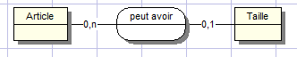

Un article lorsqu’il s’agit d’un vêtement ou de chaussures peut avoir
une taille, une taille peut appartenir à un ou plusieurs articles.

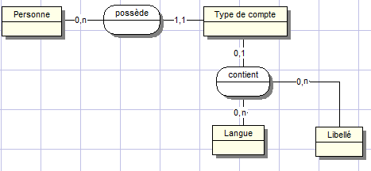

Une personne possède un type de compte, qui est définit lors de la
création d’un compte. Les types de compte sont les suivants :

- Acheteur

- Boutique

- Garage

- Vendeur non professionnel

Un type de compte peut contenir de zéro à une langue, une langue peut
être contenue par zéro à un type de compte. Un libellé peut être contenu
par zéro à un type de compte.

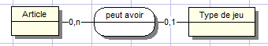

Un article tel qu’un jeu vidéo, peut avoir un type de jeu, un type de
jeu peut appartenir à un ou plusieurs articles.

Les types de jeux sont les suivants :

- Adultes

- Anime / Hentai

- Classique

- Voitures

- Sports

- Shoot’em up

- Habilité

- Logique

- Combat

- Stratégie

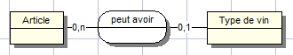

Un article s’il est un vin peut avoir un type de vin, un type de vin
peut appartenir à un ou plusieurs articles.

Les types de vins sont les suivants :

- Vin rouge

- Vin blanc

- Vin rosé

- Champagne

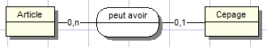

Un article s’il est de type vin peut avoir un cépage, la liste des
cépages sont les suivants :

- Fendant

- Malvoisie (Pinot Gris)

- Ermitage (Marsanne Blanche)

- Amigne

- Petite Arvine

- Sylvaner

- Pinot Noir

- Gamay

- Syrah

- Humagne rouge

- Cornalin

- Chasselas

- Pinot blanc');

- Chardonnay

- Pinot gris

- Riesling x Sylvaner

- Gamay

- Pinot noir

- Gamaret

- Garanoir

- Merlot

- Syrah

- Müller-Thurgau (Riesling x Syl

- Pinot gris (Grauburgunder

- Pinot blanc (Weissburgunder

- Gewürztramine

- Räuschling

- Chardonnay

- Pinot noir (Blauburgunder)

- Gamaret

- Garanoir

- Regent

- Chasselas

- Pinot blanc

- Aligoté

- Chardonnay

- Pinot gris

- Müller-Thurgau

- Sauvignon blanc

- Gewürztraminer

- Pinot noir

- Gamay

- Gamaret

- Garanoir

- Merlot

- Syrah

- Merlot

- Chardonnay

- Chasselas

- Sauvignon

- Sémillon

- Merlot

- Cabernet Sauvignon

- Gamaret

- Chasselas

- Sauvignon blanc

- Chardonnay

- Pinot gris

- Riesling x Sylvaner

- Gewürztraminer

- Riesling x Sylvaner (Müller-Thurgau)

- Pinot noir

- Gamaret

- Garanoir

- Chasselas

- Sauvignon blanc

- Chardonnay

- Pinot gris

- Riesling

- Gewürztraminer

- Riesling x Sylvaner (Müller-Thurgau)

- Pinot noir

- Gamaret

- Garanoir

- Chasselas

- Pinot gris

- Traminer

- Pinot noir

- Gamaret

- Garanoir

- Alsace Chasselas (Gutedel)

- Alsace Edelzwicker

- Alsace Grand Cru

- Alsace Grand Cru Altenberg de Bergbieten

- Alsace Grand Cru Altenberg de Bergheim

- Alsace Grand Cru Altenberg de Wolxheim

- Alsace Grand Cru Brand

- Alsace Grand Cru Bruderthal

- Alsace Grand Cru Eichberg

- Alsace Grand Cru Engelberg

- Alsace Grand Cru Florimont

- Alsace Grand Cru Franckstein

- Alsace Grand Cru Froehn

- Alsace Grand Cru Furstentum

- Alsace Grand Cru Geisberg

- Alsace Grand Cru Gloeckelberg

- Alsace Grand Cru Goldert

- Alsace Grand Cru Hatschbourg

- Alsace Grand Cru Hengst

- Alsace Grand Cru Kanzlerberg

- Alsace Grand Cru Kastelb

- Alsace Grand Cru Kessler

- Alsace Grand Cru Kirchberg de Barr

- Alsace Grand Cru Kirchberg de Ribeauvill

- Alsace Grand Cru Kitterlé'

- Alsace Grand Cru Mambourg

- Alsace Grand Cru Mandelberg

- Alsace Grand Cru Marckrain

- Alsace Grand Cru Moenchberg

- Alsace Grand Cru Muenchberg

- Alsace Grand Cru Ollwiller

- Alsace Grand Cru Osterberg

- Alsace Grand Cru Pfersigberg

- Alsace Grand Cru Pfingstberg

- Alsace Grand Cru Praelatenberg

- Alsace Grand Cru Rangen

- Alsace Grand Cru Rosacker

- Alsace Grand Cru Saering

- Alsace Grand Cru Schoenenbourg

- Alsace Grand Cru Scholssberg

- Alsace Grand Cru Sommerberg

- Alsace Grand Cru Sonnenglanz

- Alsace Grand Cru Spiegel

- Alsace Grand Cru Sporen

- Alsace Grand Cru Steinert

- Alsace Grand Cru Steingrubler

- Alsace Grand Cru Steinklotz

- Alsace Grand Cru Vorbourg

- Alsace Grand Cru Wiebelberg

- Alsace Grand Cru Wineck-Schlossberg

- Alsace Grand Cru Winzenberg

- Alsace Grand Cru Zinnkoepflé

- Alsace Grand Cru Zotzenberg

- Alsace Muscat

- Alsace Pinot (Klevner)

- Alsace Pinot Noir

- Alsace Riesling

- Alsace Sylvaner

- Alsace Tokay-Pinot Gris

- Crémant d'Alsace

- Brouilly

- Chénas

- Chiroubles

- Côte de Brouilly

- Fleurie

- Juliénas

- Morgon

- Moulin-à-Vent

- Régnié

- Saint-Amour

- Bordeaux Haut-Benauge

- Côtes de Bordeaux St-Macaire

- Entre-Deux-Mers

- Entre-Deux-Mers Haut-Benauge

- Graves de Vayres

- Loupiac

- Premières Côtes de Bordeaux

- Ste-Croix du Mont

- Ste-Foy Bordeaux

- Barsac

- Cadillac

- Cérons

- Graves

- Graves Supérieures

- Pessac-Léongnan

- Sauternes

- Blayais

- Bordeaux Côtes de francs

- Canon Fronsac

- Côtes de Blaye

- Côtes de Bourg

- Côtes de Castillon

- Fronsac

- Lalande de Pomerol

- Lussac St-Emilion

- Montagne St-Emilion

- Néac

- Pomerol

- Premières Côtes de Blaye

- Puisseguin St-Emilion

- St-Emilion

- St-Emilion Grand Cru

- St-Georges St-Emilion

- Haut-Médoc

- Listrac-Médoc

- Margaux

- Médoc

- Moulis-en-Médoc

- Pauillac

- St-Estèphe

- St-Julien

- Bourgogne Côtes d'Auxerre')

- Bourgogne-Irancy

- Chablis

- Chablis Grand Cru

- Chablis Premier Cru

- Petit Chablis

- Sauvignon de St-Bris

- Bourgogne Côte Chalonnaise

- Bouzeron

- Givry

- Givry Premier Cru

- Mercurey

- Mercurey Premier Cru

- Montagny

- Montagny Premier Cru

- Rully

- Rully Premier Cru

- Aloxe-Corton

- Aloxe-Corton Premier Cru

- Auxey-Duresses

- Auxey-Duresses Premier Cru

- Batard-Montrachet

- Beaune

- Beaune Premier Cru

- Bienvenues Bâtard-Montrachet

- Blagny

- Blagny Premier Cru

- Bourgogne Hautes-Côtes de Beaune

- Charlemagne

- Chassagne-Montrachet

- Chassagne-Montrachet Premier Cru

- Chevalier-Montrachet

- Chorey-lès-Beaune

- Corton

- Corton-Charlemagne

- Côtes de Beaune

- Criots Bâtard-Montrachet

- Ladoix

- Ladoix Premier Cru

- Ladoix-Serrigny

- Maranges

- Maranges Premier Cru

- Meursault

- Meursault Premier Cru

- Monthélie

- Monthélie Premier Cru

- Montrachet

- Pernand-Vergelesses

- Pernand-Vergelesses Premier Cru

- Pommard

- Pommard Premier Cru

- Puligny-Montrachet

- Puligny-Montrachet Premier Cru

- Saint-Aubin

- Saint-Romain

- Santenay

- Santenay Premier Cru

- Savigny-lès-Beaune

- Savigny-lès-Beaune Premier Cru

- St Aubin Premier Cru

- Volnay

- Volnay Premier Cru

- Volnay Santenots

- Bonnes Mares

- Bourgogne Hautes-Côtes de Nuits

- Chambertin

- Chambertin-Clos de Bèze

- Chambolle-Musigny

- Chambolle-Musigny Premier Cru

- Chapelle-Chambertin

- Charmes-Chambertin

- Clos de la Roche

- Clos des Lambrays

- Clos de Tart

- Clos de Vougeot

- Clos Saint-Denis

- Echezeaux

- Fixin

- Fixin Premier Cru

- Gevrey-Chambertin

- Gevrey-Chambertin Premier Cru

- Grands-Echezeaux

- Griotte-Chambertin

- La Grande Rue

- La Romanée

- La Tâche

- Latricières-Chambertin

- Marsannay

- Marsannay Rosé

- Mazis-Chambertin

- Mazoyères-Chambertin

- Morey-St-Denis

- Morey-St-Denis Premier Cru

- Musigny

- Nuits Premier Cru ou Nuits-St-Georges

- Nuits-Saint-Georges

- Richebourg

- Romanée-Conti

- Romanée-Saint-Vivant

- Ruchottes-Chambertin

- Vosne-Romané

- Vosne-Romanée Premier Cru

- Vougeot

- Vougeot Premier Cru

- Bourgogne Côtes du Couchois

- Mâcon

- Mâcon-Supérieur

- Mâcon-Villages

- Pouilly-Fuissé

- Puilly-Loché

- Pouilly-Vinzelles

- Saint-Véran

- Roussette de Bugey

- Roussette de Bugey Anglefort

- Roussette de Bugey Arbignieu

- Roussette de Bugey Montagnieu

- Roussette de Bugey Virieu-le-Grand

- Roussettte de Bugey Lagnieu

- Vin du Buget Montagnieu

- Vin du Bugey

- Vin du Bugey Cerdon

- Vin du Bugey Cerdon Mousseux

- Vin du Bugey Cerdon Pétillant

- Vin du Bugey Machuraz

- Vin du Bugey Manicle

- Vin du Bugey Montagnieu

- Vin du Bugey Mousseux

- Vin du Bugey Pétillant

- Vin du Bugey Virieu-le-Grand

- Champagne

- Coteaux Champenois

- Coteaux Champenois

- Rosé des Riceys

- Ajaccio

- Muscat du Cap Corse

- Patrimonio

- Vin de Corse

- Vin de Corse Calvi

- Vin de Corse Coteaux du Cap Corse

- Vin de Corse Figari

- Vin de Corse Porto-Vecchio

- Vin de Corse Sartène

- Côtes de Toul

- Vin de Moselle

- Arbois

- Arbois Mousseux

- Arbois Pupillin

- Château-Chalon

- Côtes du Jura

- Côtes du Jura Mousseux

- Crémant du Jura

- L'Etoile

- L'Etoile Mousseux

- Blanquette de Limoux

- Blanquette méthode ancéstrale

- Clairette du Languedoc

- Corbières

- Coteaux de la Méjanelle ( La Méjanelle)

- Coteaux de Languedoc St-Saturnin

- Coteaux de St-Cristol

- Coteaux de Vérargues

- Coteaux du Languedoc

- Coteaux du Languedoc Cabrières

- Coteaux du Languedoc La Clape

- Coteaux du Languedoc Montpeyroux

- Coteaux du Languedoc Picpoul-de-Pinet

- Coteaux du Languedoc Pic-St-Loup

- Coteaux du Languedoc Quatourze

- Coteaux du Languedoc St-Drézéry

- Coteaux du Languedoc St-Georges-d'Orques

- Côtes de la Malapère

- Côtes de Millau

- Côtes du Cabardès et de l'Orbiel

- Crémant de Limoux

- Faugères

- Fitou

- Limoux

- Minervois

- St-Chinian

- Anjou

- Anjou Rive Droite

- Anjou Rive Gauche

- Auvergne

- Centre

- Pays Nantais

- Poitou

- Saumurois

- Touraine

- Vendée

- Coteaux du Lyonnais

- Bandol

- Baux de Provence

- Bellet

- Cassis

- Coteaux d'Aix-en-Provence

- Coteaux du Pierrevert

- Coteaux Varois

- Côtes de Provence

- Palette

- Châteaumeillant

- Châtillon-en-Diois

- Clairette de Die

- Coteaux de Die

- Crémant de Die

- Châteauneuf-du-Pape

- Clairette de Bellegarde

- Costières de Nîmes

- Coteaux du Tricastin

- Côtes du Lubéron

- Côtes du Rhône Beaumes-de-Venise

- Côtes du Rhône Cairanne

- Côtes du Rhône Chusclan

- Côtes du Rhône Laudun

- Côtes du Rhône Roaix

- Côtes du Rhône Rochegude

- Côtes du Rhône Sablet

- Côtes du Rhône Séguret

- Côtes du Rhônes Rousset-Les-Vignes

- Côtes du Rhône St-Gervais

- Côtes du Rhône St-Maurice-sur-Eygues

- Côtes du Rhône St-Pantaléon-les-Vignes

- Côtes du Rhône Valréas

- Côtes du Rhône-Villages

- Côtes du Rhône Vinsobres

- Côtes du Rhône Visan

- Côtes du Ventoux

- Côtes du Vivarais

- Côtes du Vivarais Orgnac l'Avent

- Côtes du Vivarais St-Montant

- Côtes du Vivarais St-Remèze

- Gigondas

- Lirac

- Muscat de Beaumes-de-Venise

- Rasteau

- Tavel

- Vacqueyras

- Château Grillet

- Condrieu

- Cornas

- Côte Rôtie

- St-joseph

- St-Péray

- St-Péray Mousseux

- Crozes-Hermitage

- Hermitage

- Côte du Rhône

- Banyuls

- Collioure

- Côtes du Roussillon

- Côtes du Roussillon-villages

- Côtes du Roussillon-villages Caramany

- Côtes du Roussillon-Villages Latour-de-France

- Maury

- Muscat de Rivesaltes

- Rivesaltes

- Crépy

- Mousseux de Savoie

- Pétillant de Savoie

- Roussette de Savoie

- Roussette de Savoie Frangy

- Roussette de Savoie Marestel

- Roussette de Savoie Marestel-Altesse

- Roussette de Savoie Monterminod

- Roussette de Savoie Monthoux

- Seyssel

- Seyssel Mousseux

- Vin de Savoie

- Vin de Savoie Abymes

- Vin de Savoie Apremont

- Vin de Savoie Arbin

- Vin de Savoie Ayze

- Vin de Savoie Ayze Charpignat

- Vin de Savoie Ayze Mousseux

- Vin de Savoie Ayze Pétillant

- Vin de Savoie Bergeron

- Vin de Savoie Chautagne

- Vin de Savoie Chignin

- Vin de Savoie Chignin-Bergeron

- Vin de Savoie Cruet

- Vin de Savoie Jongieux

- Vin de Savoie Marignan

- Vin de Savoie Marin

- Vin de Savoie Montmélian

- Vin de Savoie Ripaille

- Vin de Savoie Ste-Marie-d'Alloix

- Vin de Savoie St-Jean-de-la-Porte

- Vin de Savoie St-Jeoire Prieuré

- Marcillac

- Vin d'Entraygues et de Fel

- Vin d'Estaing

- Bergerac

- Bergerac Sec

- Côtes de Bergerac

- Côtes de Bergerac Moelleux

- Côtes de Montravel

- Haut-Montravel

- Monbazillac

- Montravel

- Pécharmant

- Rosette

- Saussignac

- Béarn

- Côtes de St-Mont

- Côtes du Brulhois

- Madiran

- Pacherenc du Vic-Bilh

- Tursan

- Bergerac

- Bergerac Sec

- Côtes de Bergerac

- Côtes de Bergerac Moelleux

- Côtes de Montravel

- Haut-Montravel

- Monbazillac

- Montravel

- Pécharmant

- Rosette

- Saussignac

- Côtes du Frontonnais

- Côtes du Frontonnais-Fronton

- Côtes du Frontonnais-Villaudric

- Béarn

- Madiran

- Pacherenc du Vic-Bilh

- Côtes de St-Mont

- Tursan

- Cahors

- Côtes de Buzet (Garonne)

- Côtes de Duras

- Côtes de Marmandais

- Côtes du Brulhois

- Béarn

- Béarn Bellocq

- Irouléguy

- Jurançon

- Jurançon Sec

- Madiran

- Pacherenc du Vic-Bilh

- Côtes de Millau

- Gaillac

- Gaillac Doux

- Gaillac Mousseux

- Côtes du Brulhois

- Côtes du Frontonnais

- Lavilledieu

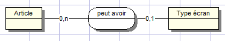

Un article peut avoir un type d’écran, un type d’écran peut être relié à
plusieurs articles.

- LCD

- Plasma

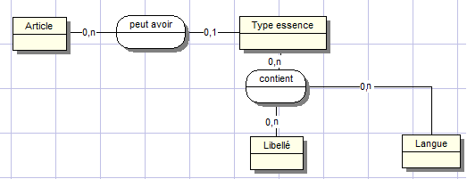

Un article peut avoir un type d’essence, un type d’essence peut être
relié à plusieurs articles. Un type essence peut contenir de zéro à un
libellé, un libellé peut être contenu par zéro à plusieurs types
essences.

- Essence

- Diesel

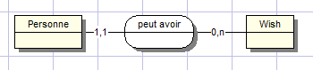

Une personne peut avoir un vœu, un vœu correspond à un article qui n’est
pas encore disponible dans une boutique, lorsque celui-ci sera
disponible une alerte sera donnée à la personne qui a fait cette
demande. Une personne peut avoir de zéro à plusieurs vœux, mais un vœu
ne peut appartenir qu’à une et une seule personne.

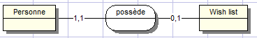

Une personne peut posséder une wish liste, une wish list ne peut
appartenir qu’à une seule personne.

## 3 Architecture applicative (Java / Spring Boot / Vaadin)

L'architecture décrite dans les sections précédentes de ce document (CGI
Perl, dispatch par paramètre « page=... », gabarits xhtml générés côté
serveur) a été abandonnée. Le projet a été réécrit en Java et suit
désormais une architecture en couches classique, organisée en deux
modules Maven :

recordz-core — modèles de domaine, repositories (accès aux données) et
services (logique métier). Indépendant de Vaadin et de Spring Web,
réutilisable si une autre interface (API REST, traitement batch) devait
un jour consommer la même logique.

recordz-web — point d'entrée Spring Boot, configuration, sécurité et
interface utilisateur Vaadin. Dépend de recordz-core.

Pile technique : Java 25, Vaadin 25, Spring Boot 3.4, Spring Security,
OAuth2 (Google), jOOQ 3.19, MySQL 9, Flyway, Docker.

### Schéma en couches

UI (vues Vaadin) — recordz-web/ui — HomeView, CatalogueView,
EncheresView, etc.

Service (logique métier) — recordz-core/service — ArticleService,
EnchereService..., annotés @Transactional

Repository (accès aux données) — recordz-core/repository — DSL jOOQ

MySQL (schéma recordz) — via le pool de connexions HikariCP

Chaque couche ne dépend que de la couche immédiatement inférieure : les
vues Vaadin n'accèdent jamais directement aux repositories, elles
passent systématiquement par la couche service. Cela remplace l'ancien
couplage direct entre les pages xhtml et les fonctions sql.pl.

Le déploiement s'appuie sur Docker (docker-compose.yml pour MySQL en
développement), et les migrations de schéma sont gérées par Flyway
plutôt que par des scripts SQL exécutés manuellement.

Le modèle physique de données ci-dessous reste conceptuellement très
proche de la conception d'origine ; il est aujourd'hui implémenté par la
migration Flyway V1\_\_recordz_schema.sql dans un schéma nommé recordz
(encodage utf8mb4). Quelques tables ont été ajoutées depuis la première
version pour les besoins de l'application (transaction, visiteur,
article_ip, article_visite, sessions), sans remettre en cause la
structure générale décrite plus bas.

## 4. Modèle physique de données
### Table article
| Attribut                   | Description                                      |
|---|---|
| Id_article                 | L’id de l’article                                |
| Nom                        | Le nom de l’article                              |
| Description                | La description de l’article                      |
| Ref_genre                  | La référence au genre de l’article               |
| Ref_type                   | La référence au type de l’article                |
| Ref_cepage                 | La référence au cépage de l’article              |
| Auteur                     | L’auteur de l’article                            |
| Marque                     | La marque de l’article                           |
| Label                      | Le label de l’article (musique)                  |
| Prix                       | Le prix de l’article                             |
| Prix_achat                 | Le prix d’achat de l’article                     |
| Pochette                   | La pochette de l’article                         |
| Presound                   | Le son en pré écoute                             |
| Ref_etat                   | La référence à l’état                            |
| Ref_categorie              | La référence à la catégorie                      |
| Ref_subcategorie           | La référence à la sous-catégorie                 |
| Owned                      | La valeur si l’article est posséder ou pas       |
| Ref_statut                 | La référence au statut                           |
| Date                       | La date de mise en vente de l’article            |
| Ref_depot                  | La référence au dépôt de l’article               |
| Ref_Taille                 | La référence à la taille de l’article            |
| Enchere                    | La valeur si un article est mis aux enchères     |
| Ref_condition_de_payement  | La référence à la condition de payement          |
| Ref_condition_de_livraison | La référence à la condition de livraison         |
| Enchere_date_debut         | La date de début de l’enchère                    |
| Enchere_date_fin           | La date de fin de l’enchère                      |
| Vendu                      | La valeur si l’article à été vendu ou non        |
| Ref_type_ecran             | La référence au type d’écran                     |
| Dimension                  | Les dimensions d’un article                      |
| Poids                      | Le poids de l’article                            |
| Nb_portes                  | Le nombre de portes d’un article                 |
| Nb_cheveaux                | Le nombre de chevaux d’un article                |
| Nb_km                      | Le nombre de kilomètre                           |
| Premiere_immatriculation   | La date de la première immatriculation           |
| Annee                      | L’année de l’article                             |
| Options                    | Les options de l’article                         |
| Essence_ou_diesel          | Essence ou diesel                                |
| Nb_piece                   | Nombre de pièce d’un bien immobilier             |
| Surface_habitable          | La surface habitable                             |
| Superficie_terrain         | La superficie d’un terrain                       |
| Visites                    | Le nombre de visite d’un article                 |
| Nbr_enchère                | Le nombre d’enchère d’un article                 |
| Ref_lang                   | La référence à la langue d’un article            |
| Ref_canton                 | La référence à un canton                         |
| Lieu                       | Le lieu d’un article                             |
| Adresse                    | L’adresse                                        |
| Npa                        | Le code postal                                   |
| Ref_location_ou_achat      | La valeur si un article est en location ou achat |
| Ref_departement            | La référence à un département                    |
| Ref_pays                   | La référence à un pays                           |
| Ref_boite_de_vitesse       | La référence à une boite de vitesse              |
| Climatisatiion             | La valeur si un article possède la climatisation |
| Processeur                 | La puissance d’un processeur                     |
| Ram                        | La capacité                                      |
| Disque_dur                 | Le disque dur                                    |
| Quantité                   | La quantité d’article                            |
| Ref_provenance             | La référence de la provenance à l’article        |
| Longueur                   | La longueur de l’article                         |
| Largeeur                   | La largeur de l’article                          |
| Consomation                | La consommation de l’article                     |
| Acteurs                    | Les acteurs                                      |
| Duree                      | La durée                                         |
| Realisateur                | Le réalisateur                                   |
| Taille                     | La taille de l’article                           |
| Ref_type_de_jeu            | La référence au type de jeu                      |
| Ref_pays_region_vin        | La référence à une région de vin                 |
| Ref_type_de_vin            | La référence au type de vin                      |
| Ref_etat                   | La référence à un état                           |
| Frais_de_livraison         | Les frais de livraison d’un article              |
| Wat                        | La puissance en wat d’un article                 |
| Nb_cylindre                | Le nombre de cylindre d’un article               |

### Table article_libelle_langue
| Attribut    | Description              |
|---|---|
| Ref_article | La référence à l’article |
| Ref_langue  | La référence à la langue |
| Ref_libelle | La référence au libellé  |

### Table langue
| Attribut  | Description                |
|---|---|
| Id_langue | L’identifiant de la langue |
| Key       | La clef de la langue       |

### Table langue_libelle
| Attribut    | Description               |
|---|---|
| Ref_langue  | La référence de la langue |
| Ref_libelle | La référence au libellé   |

### Table a_livre
| Attribut              | Description                       |
|---|---|
| Id_a_livré            | L’identifiant de à livré          |
| Ref_article           | La référence à l’article          |
| Ref_acheteur          | La référence à l’acheteur         |
| Ref_vendeur           | La référence au vendeur           |
| Date_achat            | La date d’achat                   |
| Ref_mode_de_livraison | La référence au mode de livraison |
| Ref_statut            | La référence au statut            |
| Quantité              | La quantité d’article             |
| Montant               | Le montant                        |
| Date_reception        | La date de réception de l’article |

### Table a_paye
| Attribut               | Description                         |
|---|---|
| Id_a_paye              | L’identifiant à payé                |
| Ref_article            | La référence à un article           |
| Ref_vendeur            | La référence à un vendeur           |
| Ref_acheteur           | La référence à un acheteur          |
| Ref_enchere            | La référence à une enchère          |
| Ref_mode_de_livraison  | La référence à un mode de livraison |
| Ref_mode_de_payement   | La référence à un mode de payement  |
| Ref_statut             | La référence à un statut            |
| Montant                | Le montant                          |
| Date fermeture enchere | La date de fermeture de l’enchère   |
| Date_payement          | La date de payement                 |
| Date_echeance          | La date d’échéance d’une enchère    |
| Rappel_1               | Le premier rappel                   |
| Rappel_2               | Le deuxième rappel                  |
| Rappel_3               | Le troisième rappel                 |
| Quantité               | La quantité                         |

### Table boite_de_vitessse
| Attribut            | Description                          |
|---|---|
| Id_boite_de_vitesse | L’identifiant de la boite de vitesse |

### Table boite_de_vitesse_libelle_langue
| Attribut             | Description                         |
|---|---|
| Ref_boite_de_vitesse | La référence à une boite de vitesse |
| Ref_langue           | La référence à une langue           |
| Ref_libellé          | La référence à un libellé           |

### Table boutique
| Attribut           | Description                            |
|---|---|
| Id_boutique        | L’identifiant de la boutique           |
| Nom                | Le nom de la boutique                  |
| Date_creation      | La date de création de la boutique     |
| Ref_personne       | La référence au gérant de la boutique  |
| Ref_main_categorie | La référence à la catégorie principale |
| Image              | Le logo de la boutique                 |

### Table boutique_a_categorie
| Attribut      | Description                 |
|---|---|
| Ref_boutique  | La référence à la boutique  |
| Ref_categorie | La référence à la catégorie |

### Table canton_fr
| Attribut  | Description             |
|---|---|
| Id_canton | L’identifiant du canton |
| Key       | La clef du canton       |
| Nom       | Le nom du canton        |

### Table canton_de
| Attribut  | Description             |
|---|---|
| Id_canton | L’identifiant du canton |
| Key       | La clef du canton       |
| Nom       | Le nom du canton        |

### Table canton_it
| Attribut  | Description             |
|---|---|
| Id_canton | L’identifiant du canton |
| Key       | La clef du canton       |
| Nom       | Le nom du canton        |

### Table catégorie
| Attribut     | Description                   |
|---|---|
| Id_categorie | L’identifiant de la catégorie |

### Table catégorie_libellé_langue
| Attribut      | Description                  |
|---|---|
| Ref_categorie | La référence à une catégorie |
| Ref_langue    | La référence à une langue    |
| Ref_libelle   | La référence à un libellé    |

### Table cepage
| Attribut  | Description             |
|---|---|
| Id_cepage | L’identifiant du cépage |

### Table cepage_libelle_langue
| Attribut    | Description               |
|---|---|
| Ref_cepage  | La référence au cépage    |
| Ref_langue  | La référence à la langue  |
| Ref_libelle | La référence à un libellé |

### Table commande
| Attribut             | Description                      |
|---|---|
| Id_commande          | L’identifiant de la commande     |
| sessionID            | La session de l’utilisateur      |
| Ref_client           | La référence au client           |
| Date                 | La date                          |
| Ref_mode_de_payement | La référence au mode de payement |
| Ref_depot            | La référence au dépôt            |

### Table commande_article
| Attribut      | Description                |
|---|---|
| Ref_commande  | La référence à la commande |
| Ref_article   | La référence à l’article   |
| Date_payement | La date de payement        |

### Table commentaire
| Attribut       | Description                                          |
|---|---|
| Id_commentaire | L’identifiant du commentaire                         |
| Ref_article    | La référence à l’article                             |
| Ref_emetteur   | La référence à la personne ayant émis le commentaire |
| Question       | La question                                          |
| Texte          | Le texte                                             |
| Date           | La date                                              |

### Table condition_livraison
| Attribut                  | Description                                |
|---|---|
| Id_condition_de_livraison | L’identifiant de la condition de livraison |
| Frais                     | Les frais de la condition de livraison     |

### Table condition_livraison_libelle_langue
| Attribut                   | Description                              |
|---|---|
| Ref_condition_de_livraison | La référence à la condition de livraison |
| Ref_langue                 | La référence à la langue                 |
| Ref_libellé                | La référence au libellé                  |

### Table condition_payement
| Attribut              | Description                               |
|---|---|
| Id_condition_payement | L’identifiant de la condition de payement |

### Table condition_payement_libelle_langue
| Attribut               | Description                              |
|---|---|
| Ref_condition_payement | La référence à une condition de payement |
| Ref_libelle            | La référence à un libellé                |
| Ref_langue             | La référence à une langue                |

### Table demande_visite
| Attribut          | Description                                           |
|---|---|
| Id_demande_visite | L’identifiant de la demande de visite                 |
| Reponse_par_email | La valeur si la réponse doit être donné par email     |
| Reponse_par_tel   | La valeur si la réponse doit être donné par téléphone |
| Nom               | Le nom                                                |
| Prenom            | Le prénom                                             |
| Nom               | Le nom                                                |
| Adresse           | L’adresse                                             |
| Npa               | Le npa                                                |
| Ville             | La ville                                              |
| Telephone         | Le téléphone                                          |
| Ref_article       | La référence à l’article                              |
| Ref_vendeur       | La référence au vendeur                               |
| Commentaire       | Le commentaire                                        |

### Table departement
| Attribut       | Description                  |
|---|---|
| Id_departement | L’identifiant du département |
| Code           | Le code du département       |

Table_departement_libelle_langue

| Attribut        | Description                   |
|---|---|
| Ref_departement | La référence à un département |
| Ref_langue      | La référence à une langue     |
| Ref_libelle     | La référence à un libellé     |

### Table enchere
| Attribut      | Description                |
|---|---|
| Id_enchere    | L’identifiant de l’enchère |
| Ref_article   | La référence à l’article   |
| ref_enchereur | La référence à l’enchèreur |
| Prix          | Le prix                    |
| Date_enchère  | La date de l’enchère       |

### Table etat
| Attribut | Description             |
|---|---|
| Id_etat  | L’identifiant de l’état |

### Table etat_libelle_langue
| Attribut    | Description               |
|---|---|
| Ref_etat    | La référence à l’état     |
| Ref_langue  | La référence à la langue  |
| Ref_libelle | La référence à un libellé |

### Table evaluation_achat
| Attribut            | Description                         |
|---|---|
| Id_evaluation_achat | L’identifiant de l’évaluation achat |
| Ref_vendeur         | La référence au vendeur             |
| Ref_acheteur        | La référence à l’acheteur           |
| Ref_article         | La référence à l’article            |
| Note                | La note de l’article                |
| Commentaire         | Le commentaire                      |
| Date                | La date                             |

### Table evaluation_article
| Attribut              | Description                           |
|---|---|
| Id_evaluation_article | L’identifiant de l’évaluation article |
| Ref_vendeur           | La référence au vendeur               |
| Ref_acheteur          | La référence à l’acheteur             |
| Ref_article           | La référence à l’article              |
| Note                  | La note de l’article                  |
| Date                  | La date                               |

### Table evaluation_vente
| Attribut            | Description                         |
|---|---|
| Id_evaluation_vente | L’identifiant de l’évaluation vente |
| Ref_vendeur         | La référence au vendeur             |
| Ref_acheteur        | La référence à l’acheteur           |
| Ref_article         | La référence à l’article            |
| Note                | La note de l’article                |
| Commentaire         | Le commentaire                      |
| Date                | La date                             |

### Table genre
| Attribut | Description            |
|---|---|
| Id_genre | L’identifiant du genre |

### Table genre_libelle_langue
| Attribut    | Description              |
|---|---|
| Ref_genre   | La référence au genre    |
| Ref_langue  | La référence à la langue |
| Ref_libelle | La référence au libellé  |

### Table libellé
| Attribut   | Description              |
|---|---|
| Id_libelle | L’identifiant du libellé |
| Libelle    | La valeur du libellé     |

### Table label
| Attribut | Description            |
|---|---|
| Id_label | L’identifiant du label |

### Table label_libelle_langue
| Attribut    | Description              |
|---|---|
| Ref_label   | La référence au label    |
| Ref_langue  | La référence à la langue |
| Ref_libelle | La référence au libellé  |

### Table location_ou_achat
| Attribut             | Description                        |
|---|---|
| Id_location_ou_achat | L’identifiant de location ou achat |
|                      |                                    |

### Table location_ou_achat_libelle_langue
| Attribut              | Description                       |
|---|---|
| Ref_location_ou_achat | La référence ou location ou achat |
| Ref_libelle           | La référence au libellé           |
| Ref_langue            | La référence à la langue          |

### Table main_categorie
| Attribut          | Description                        |
|---|---|
| Id_main_categorie | L’identifiant de la main catégorie |

### Table main_categorie_libelle_langue
| Attribut           | Description                      |
|---|---|
| Ref_main_categorie | La référence à la main catégorie |
| Ref_langue         | La référence à la langue         |
| Ref_libellé        | La référence à un libellé        |

### Table met_en_vente
| Attribut        | Description                                                                   |
|---|---|
| Ref_vendeur     | La référence à un vendeur                                                     |
| Ref_article     | La référence à un article                                                     |
| Date_stock      | La date du début de la mise en enchère                                        |
| Page_principale | Affichage ou pas sur la page principale                                       |
| Page_categorie  | Affichage ou pas sur la page catégorie                                        |
| Pack_photo      | Option qui permet à l’utilisateur de choisir un pack de photos supplémentaire |
| Notre_selection | La sélection d’article faite par les modérateurs                              |
| Ref_statut      | La référence au statut                                                        |

### Table mode_de_payement
| Attribut            | Description                       |
|---|---|
| Id_mode_de_payement | L’identifiant du mode de payement |

### Table mode_de_payement \_libelle_langue
| Attribut             | Description                      |
|---|---|
| Ref_mode_de_payement | La référence au mode de payement |
| Ref_langue           | La référence à une langue        |
| ref_libelle          | La référence au libellé          |

### Table mois
| Attribut | Description           |
|---|---|
| Id_mois  | L’identifiant du mois |

### Table mois_libelle_langue
| Attribut    | Description              |
|---|---|
| Ref_mois    | La référence au mois     |
| Ref_langue  | La référence à la langue |
| Ref_libelle | La référence au libellé  |

### Table pays
| Attribut | Description           |
|---|---|
| Id_pays  | L’identifiant du pays |
| Iso_code | L’iso code du pays    |

### Table pays_libellle_langue
| Attribut    | Description              |
|---|---|
| Ref_pays    | La référence au pays     |
| Ref_langue  | La référence à la langue |
| Ref_libellé | La référence au libellé  |

### Table pays_present
| Attribut        | Description                  |
|---|---|
| Id_pays_present | La référence au pays présent |
| Iso_code        | L’iso code du pays           |
| Nom             | Le nom du pays présent       |

### Table pays_region_vin
| Attribut           | Description                          |     |
|---|---|
| Id_pays_region_vin | L’identifiant du pays présent du vin |     |
| Nom                | Le nom du pays                       |     |

### Table cepage
| Attribut            | Description                              |
|---|---|
| Id_cepage           | L’identifiant du cépage                  |
| Ref_pays_region_vin | La référence au pays de la région du vin |
| Ref_type_de_vin     | La référence au type de vin              |
| Nom                 | Le nom du cépage                         |

### Table commande
| Attribut             | Description                      |
|---|---|
| Id_commande          | L’identifiant de la commande     |
| sessionID            | La session de l’utilisateur      |
| Ref_client           | La référence au client           |
| Date                 | La date de la commande           |
| Ref_mode_de_payement | La référence au mode de payement |
| Date_de_payement     | La date de payement              |
| Ref_depot            | La référence au dépôt            |

### Table commande_article
| Attribut      | Description                |
|---|---|
| Ref_commande  | La référence à la commande |
| Ref_article   | La référence à l’article   |
| Date_payement | La date de payement        |

### Table commentaire
| Attribut       | Description                  |
|---|---|
| Id_commentaire | L’identifiant du commentaire |
| Ref_article    | La référence à l’article     |
| Ref_emetteur   | La référence à l’émetteur    |
| Question       | La question                  |
| Texte          | Le texte                     |
| Date           | La date du commentaire       |

### Table condition_livraison
| Attribut               | Description                                |
|---|---|
| Id_condition_livraison | L’identifiant de la condition de livraison |
| Frais                  | Les frais de la condition de livraison     |

### Table condition_livraison_libelle_langue
| Attribut                   | Description                              |
|---|---|
| Ref_id_condition_livraison | La référence à la condition de livraison |
| Ref_libelle                | La référence au libellé                  |
| Ref_langue                 | La référence à la langue                 |

### Table condition_payement
| Attribut              | Description                               |
|---|---|
| Id_condition_payement | L’identifiant de la condition de payement |
| Frais                 | Les frais de la condition de payement     |

### Table condition_payement_libelle_langue
| Attribut                  | Description                             |
|---|---|
| Ref_id_condition_payement | La référence à la condition de payement |
| Ref_libelle               | La référence au libellé                 |
| Ref_langue                | La référence à la langue                |

### Table demande_visite
| Attribut              | Description                                      |
|---|---|
| Id_demande_visite     | L’identifiant de la demande de visite            |
| Reponse_par_email     | La valeur si la personne doit répondre par email |
| Reponse par telephone | La réponse par téléphone                         |
| Nom                   | Le nom                                           |
| Prénom                | Le prénom                                        |
| Adresse               | L’adresse                                        |
| Npa                   | Le code postal                                   |
| Ville                 | La ville                                         |
| Ref_article           | La référence à l’article                         |
| Ref_vendeuur          | La référence au vendeur                          |
| Commentaire           | Un commentaire laissé par la personne            |

### Table departement
| Attribut       | Description                  |
|---|---|
| Id_departement | L’identifiant du département |
| Code           | Le code du département       |

### Table departement_libelle_langue
| Attribut        | Description                 |
|---|---|
| Ref_departement | La référence au département |
| Ref_langue      | La référence à la langue    |
| Ref_libelle     | La référence au libellé     |

### Table depot
| Attribut       | Description                          |
|---|---|
| Id_depot       | L’identifiant du dépôt               |
| Nom            | Le nom du dépôt                      |
| Adresse        | L’adresse du dépôt                   |
| Npa            | Le code postal du dépôt              |
| Ref_pays       | La référence au pays du dépôt        |
| Telephone      | Le numéro de téléphone du dépôt      |
| Email          | L’email du dépôt                     |
| Ref_resposable | La référence au responsable du dépôt |

### Table enchere
| Attribut      | Description                |
|---|---|
| Id_enchere    | L’identifiant de l’enchère |
| Ref_article   | La référence à l’article   |
| Ref_enchereur | La référence à l’enchereur |
| Prix          | Le prix                    |
| Date_enchere  | La date de mise au enchère |

### Table evaluation_achat
| Attribut            | Description                              |
|---|---|
| Id_evaluation_achat | L’identifiant de l’évaluation de l’achat |
| Ref_vendeur         | La référence au vendeur                  |
| Ref_acheteur        | La référence à l’acheteur                |
| Ref_article         | La référence à l’article                 |
| Note                | La note donnée à l’achat                 |
| Commentaire         | Le commentaire                           |
| Date                | La date de l’évaluation                  |

### Table evaluation_article
| Attribut              | Description                                |
|---|---|
| Id_evaluation_article | L’identifiant de l’évaluation de l’article |
| Ref_article           | La référence à l’article                   |
| Ref_vendeur           | La référence au vendeur                    |
| Ref_acheteur          | La référence à l’acheteur                  |
| Note                  | La note de l’évaluation                    |
| Date                  | La date de l’évaluation                    |

### Table evaluation_vente
| Attribut            | Description                               |
|---|---|
| Id_evaluation_vente | L’identifiant de l’évaluation de la vente |
| Ref_article         | La référence à l’article                  |
| Ref_vendeur         | La référence au vendeur                   |
| Ref_acheteur        | La référence à l’acheteur                 |
| Note                | La note de l’évaluation                   |
| Date                | La date de l’évaluation                   |

### Table genre
| Attribut | Description            |
|---|---|
| Id_genre | L’identifiant du genre |

### Table genre_libelle_langue
| Attribut    | Description              |
|---|---|
| Ref_genre   | La référence au genre    |
| Ref_langue  | La référence à la langue |
| Ref_libellé | La référence au libellé  |

### Table label
| Attribut | Description            |
|---|---|
| Id_label | L’identifiant du label |

### Table label_libelle_langue
| Attribut    | Description              |
|---|---|
| Ref_label   | La référence au label    |
| Ref_langue  | La référence à la langue |
| Ref_libelle | La référence au libellé  |

### Table location_ou_achat
| Attribut             | Description                              |
|---|---|
| Id_location_ou_achat | L’identification de la location ou achat |

### Table location_ou_achat_libelle_langue
| Attribut              | Description                         |
|---|---|
| Ref_location_ou_achat | La référence à la location ou achat |
| Ref_langue            | La référence à la langue            |
| Ref_libelle           | La référence au libellé             |

### Table pointure
| Attribut    | Description                  |
|---|---|
| Id_pointure | L’identifiant de la pointure |

### Table pointure_libelle_langue
| Attribut     | Description                |
|---|---|
| Ref_pointure | La référence à la pointure |
| Ref_libelle  | La référence au libellé    |
| Ref_langue   | La référence à la langue   |

### Table publication_option
| Attribut              | Description                            |
|---|---|
| Id_publication_option | L’identifiant de la publication option |
| Prix                  | Le prix                                |

### Table publication_option_libelle_langue
| Attribut               | Description                          |
|---|---|
| Ref_publication_option | La référence à la publication option |
| Ref_langue             | La référence à la langue             |
| Ref_libelle            | La référence au libellé              |

### Table recherche
| Attribut      | Description                   |
|---|---|
| Id_recherche  | L’identifiant de la recherche |
| Nbr           | Le nombre de recherche        |
| Ref_categorie | La référence à la catégorie   |
| Ref_article   | La référence à l’article      |

### Table session
| Attribut  | Description                        |
|---|---|
| Id        | L’identifiant de la session        |
| A_session | La valeur de la session            |
| Username  | Le nom d’utilisateur de la session |

### Table statut
| Attribut  | Description             |
|---|---|
| Id_statut | L’identifiant du statut |

### Table statut_libelle_langue
| Attribut    | Description              |
|---|---|
| Ref_statut  | La référence au statut   |
| Ref_langue  | La référence à la langue |
| Ref_libelle | La référence au libellé  |

### Table subcategorie
| Attribut        | Description                        |
|---|---|
| Id_subcategorie | L’identifiant de la sous-catégorie |
| Ref_categorie   | La référence à la catégorie        |

### Table subcategorie_libelle_langue
| Attribut         | Description                      |
|---|---|
| Ref_subcategorie | La référence à la sous-catégorie |
| Ref_libelle      | La référence au libellé          |
| Ref_langue       | La référence à la langue         |

### Table taille
| Attribut  | Description                |
|---|---|
| Id_taille | L’identifiant de la taille |

### Table taille_libelle_langue
| Attribut    | Description              |
|---|---|
| Ref_taille  | La référence à la taille |
| Ref_libelle | La référence au libellé  |
| Ref_langue  | La référence à la langue |

### Table temps
| Attribut | Description            |
|---|---|
| Id_temps | L’identifiant du temps |

### Table temps_libelle_langue
| Attribut    | Description              |
|---|---|
| Ref_temps   | La référence au temps    |
| Ref_langue  | La référence à la langue |
| Ref_libelle | La référence au libellé  |

### Table type_de_compte
| Attribut          | Description                     |
|---|---|
| Id_type_de_compte | L’identifiant du type de compte |
| Prix              | Le prix du type de compte       |

### Table type_de_compte_libelle_langue
| Attribut           | Description                    |
|---|---|
| Ref_type_de_compte | La référence au type de compte |
| Ref_langue         | La référence à la langue       |
| Ref_libelle        | La référence au libellé        |

### Table type_de_jeu
| Attribut       | Description                  |
|---|---|
| Id_type_de_jeu | L’identifiant du type de jeu |

### Table type_de_jeu_libelle_langue
| Attribut        | Description                 |
|---|---|
| Ref_type_de_jeu | La référence au type de jeu |
| Ref_langue      | La référence à la langue    |
| Ref_libelle     | La référence au libellé     |

### Table type_de_vin
| Attribut       | Description                  |
|---|---|
| Id_type_de_vin | L’identifiant du type de vin |

### Table type_de_vin_libelle_langue
| Attribut        | Description                 |
|---|---|
| Ref_type_de_vin | La référence au type de vin |
| Ref_libelle     | La référence au libellé     |
| Ref_langue      | La référence à la langue    |

### Table type_ecran
| Attribut      | Description                   |
|---|---|
| Id_type_ecran | L’identifiant du type d’écran |

### Table type_ecran_libelle_langue
| Attribut       | Description                |
|---|---|
| Ref_type_ecran | La référence au type écran |
| Ref_libelle    | La référence au libellé    |
| Ref_langue     | La référence à la langue   |

### Table type_essence
| Attribut        | Description                   |
|---|---|
| Id_type_essence | L’identifiant du type essence |

### Table type_essence_libelle_langue
| Attribut         | Description                    |
|---|---|
| Ref_type_essence | La référence au type d’essence |
| Ref_libelle      | La référence au libellé        |
| Ref_langue       | La référence à la langue       |

### Table wish
| Attribut                   | Description                                      |
|---|---|
| Id_article                 | L’id de l’article                                |
| Nom                        | Le nom de l’article                              |
| Ref_wish_list              | La référence à la liste de vœu                   |
| Ref_user                   | La référence à la personne                       |
| Description                | La description de l’article                      |
| Ref_genre                  | La référence au genre de l’article               |
| Ref_type                   | La référence au type de l’article                |
| Ref_cepage                 | La référence au cépage de l’article              |
| Auteur                     | L’auteur de l’article                            |
| Marque                     | La marque de l’article                           |
| Label                      | Le label de l’article (musique)                  |
| Prix                       | Le prix de l’article                             |
| Prix_achat                 | Le prix d’achat de l’article                     |
| Pochette                   | La pochette de l’article                         |
| Presound                   | Le son en pré écoute                             |
| Ref_etat                   | La référence à l’état                            |
| Ref_categorie              | La référence à la catégorie                      |
| Ref_subcategorie           | La référence à la sous-catégorie                 |
| Owned                      | La valeur si l’article est posséder ou pas       |
| Ref_statut                 | La référence au statut                           |
| Date                       | La date de mise en vente de l’article            |
| Ref_depot                  | La référence au dépôt de l’article               |
| Ref_Taille                 | La référence à la taille de l’article            |
| Enchere                    | La valeur si un article est mis aux enchères     |
| Ref_condition_de_payement  | La référence à la condition de payement          |
| Ref_condition_de_livraison | La référence à la condition de livraison         |
| Enchere_date_debut         | La date de début de l’enchère                    |
| Enchere_date_fin           | La date de fin de l’enchère                      |
| Vendu                      | La valeur si l’article à été vendu ou non        |
| Ref_type_ecran             | La référence au type d’écran                     |
| Dimension                  | Les dimensions d’un article                      |
| Poids                      | Le poids de l’article                            |
| Nb_portes                  | Le nombre de portes d’un article                 |
| Nb_cheveaux                | Le nombre de chevaux d’un article                |
| Nb_km                      | Le nombre de kilomètre                           |
| Premiere_immatriculation   | La date de la première immatriculation           |
| Annee                      | L’année de l’article                             |
| Options                    | Les options de l’article                         |
| Essence_ou_diesel          | Essence ou diesel                                |
| Nb_piece                   | Nombre de pièce d’un bien immobilier             |
| Surface_habitable          | La surface habitable                             |
| Superficie_terrain         | La superficie d’un terrain                       |
| Visites                    | Le nombre de visite d’un article                 |
| Nbr_enchère                | Le nombre d’enchère d’un article                 |
| Ref_lang                   | La référence à la langue d’un article            |
| Ref_canton                 | La référence à un canton                         |
| Lieu                       | Le lieu d’un article                             |
| Adresse                    | L’adresse                                        |
| Npa                        | Le code postal                                   |
| Ref_location_ou_achat      | La valeur si un article est en location ou achat |
| Ref_departement            | La référence à un département                    |
| Ref_pays                   | La référence à un pays                           |
| Ref_boite_de_vitesse       | La référence à une boite de vitesse              |
| Climatisatiion             | La valeur si un article possède la climatisation |
| Processeur                 | La puissance d’un processeur                     |
| Ram                        | La capacité                                      |
| Disque_dur                 | Le disque dur                                    |
| Quantité                   | La quantité d’article                            |
| Ref_provenance             | La référence de la provenance à l’article        |
| Longueur                   | La longueur de l’article                         |
| Largeeur                   | La largeur de l’article                          |
| Consomation                | La consommation de l’article                     |
| Acteurs                    | Les acteurs                                      |
| Duree                      | La durée                                         |
| Realisateur                | Le réalisateur                                   |
| Taille                     | La taille de l’article                           |
| Ref_type_de_jeu            | La référence au type de jeu                      |
| Ref_pays_region_vin        | La référence à une région de vin                 |
| Ref_type_de_vin            | La référence au type de vin                      |
| Ref_etat                   | La référence à un état                           |
| Frais_de_livraison         | Les frais de livraison d’un article              |
| Wat                        | La puissance en wat d’un article                 |
| Nb_cylindre                | Le nombre de cylindre d’un article               |

### Table wish_list
| Attribut      | Description                     |
|---|---|
| Id_wish_list  | L’identifiant de la wish list   |
| Ref_user      | La référence à la personne      |
| Date_creation | La date de création de la liste |
|               |                                 |

## 5 Structure applicative détaillée

### Authentification et sécurité

L'authentification n'est plus gérée par un mot de passe stocké en base
et un système de session maison, mais par Spring Security couplé à
OAuth2 avec Google comme fournisseur d'identité. Le composant
CustomOAuth2UserService synchronise automatiquement le profil Google
avec la table personne (l'email sert d'identifiant unique) à chaque
connexion, par un upsert. Le champ mot_de_passe hérité de l'ancien
schéma n'est plus utilisé. La classe AuthenticatedUser expose
l'utilisateur courant aux vues Vaadin, et LoginView sert de point
d'entrée pour la connexion.

### Organisation des packages (com.example.recordz)

config/JooqConfig.java — configuration du DSL jOOQ et activation du
cache (@EnableCaching)

security/ — SecurityConfig.java, CustomOAuth2UserService.java,
AuthenticatedUser.java, LoginView.java

model/domain/ — Article, Personne, Enchere, Commande, Transaction,
Boutique, Wish / WishList, Commentaire, Referentiel, Evaluations

repository/ — ArticleRepository, PersonneRepository, EnchereRepository,
CommandeRepository, ReferentielRepository (annoté @Cacheable)

service/ — ArticleService, EnchereService (validation des règles
d'enchère), PersonneService

ui/layouts/MainLayout.java — shell applicatif et menu de navigation

ui/views/ — HomeView (accueil), CatalogueView (catalogue et recherche),
EncheresView (enchères actives), et un ensemble de vues secondaires
regroupées dans OtherViews (mes annonces, mes achats, liste de souhaits,
boutique, profil)

### Accès aux données

L'ancien module sql.pl (sqlConnect, sqlSelect, sqlInsert, sqlUpdate,
sqlSelectMany, sqlDelete) est remplacé par jOOQ : chaque repository
construit ses requêtes avec le DSL typé de jOOQ plutôt qu'avec du SQL
concaténé à la main. Les tables de référence (langues, cantons,
libellés, catégories...) sont chargées par ReferentielRepository et
mises en cache mémoire via l'annotation @Cacheable, ce qui évite de les
recharger à chaque requête comme le faisait l'ancien système.

### Logique métier

Les nombreuses fonctions de l'ancien module article.pl (ajout,
suppression, mise à jour de statut, gestion du panier, paiement,
vœux...) sont désormais réparties dans des classes de service dédiées :
ArticleService porte la logique liée aux annonces (cycle de vie d'un
article, statuts), EnchereService valide et applique les règles métier
des enchères, et PersonneService gère le cycle de vie d'un utilisateur
ou d'une boutique. Ces services sont annotés @Transactional, ce qui
garantit l'atomicité des opérations d'insertion et de suppression —
exigence déjà identifiée dans la version précédente du projet, assurée
ici par le conteneur Spring plutôt que par une gestion manuelle des
transactions SQL.

## 6 Structure d'une recherche

Le principe reste conceptuellement identique à celui décrit dans les
versions précédentes de ce document : une catégorie et une
sous-catégorie choisies par l'utilisateur déterminent les critères de
recherche disponibles. Côté implémentation, CatalogueView (Vaadin)
capture les critères saisis (catégorie, sous-catégorie, prix, marque,
etc.) et les transmet à ArticleService, qui délègue la construction et
l'exécution de la requête à ArticleRepository. La séparation entre «
index » et « table de résultat » de l'ancien système (doSearchXIndexed /
doSearchXByIndex) n'a plus de raison d'être : jOOQ construit une requête
paginée unique, et Vaadin se charge du rendu et du rafraîchissement
dynamique du composant de résultats sans rechargement de page.

## 7 Routage et chargement d'une page

L'ancien mécanisme de dispatch (une fonction loadPage centrale qui
interprétait le paramètre page transmis en requête HTTP pour appeler la
bonne fonction loadX) est remplacé par le système de routage natif de
Vaadin. Chaque vue est une classe Java annotée @Route("chemin"), par
exemple @Route("catalogue") pour CatalogueView ou @Route("encheres")
pour EncheresView. La navigation entre pages ne provoque plus de
rechargement complet : Vaadin échange les composants côté serveur et met
à jour le DOM côté client de manière incrémentale. MainLayout fournit le
cadre commun (menu, en-tête) autour de chaque vue, un rôle proche de
celui du « menu principal » auparavant répété manuellement sur chaque
page.

## 8 Clôture d'une enchère

Le principe métier reste le même que celui décrit précédemment : à
l'expiration d'une enchère, son statut doit être mis à jour, l'acheteur
et le vendeur notifiés, et l'article rendu payable. Dans l'architecture
Java, cette tâche de fond relève naturellement d'un traitement planifié
côté service (par exemple une méthode annotée @Scheduled dans
EnchereService), qui interrogerait les enchères dont la date de fin est
dépassée, mettrait à jour leur statut via EnchereRepository dans une
transaction, puis déclencherait la notification (email/SMS) de
l'acheteur et du vendeur. Ce traitement planifié reste à implémenter
dans le dépôt recordz-auction au moment de la rédaction de cette mise à
jour ; il constitue la suite logique du module EnchereService déjà en
place.
